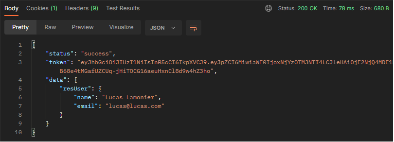
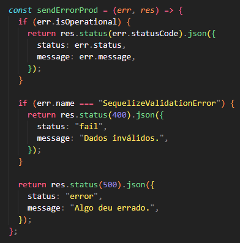
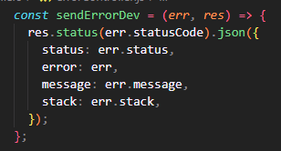
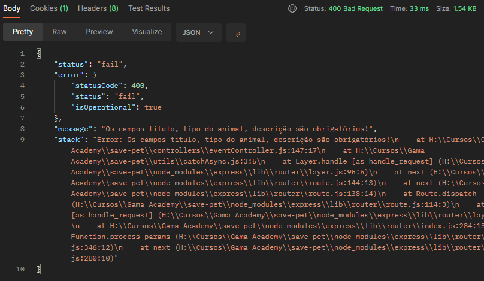

# SavePet

## Conteúdo

- [A ideia](##-A-ideia)
- [Funcionalidades](##-Funcionalidades)
- [Integração com outros serviços](##-Integração-com-outros-serviços)
- [Quickstart](##-Quickstart)
- [Endpoints](##-Endpoints)
- [A equipe](##-A-equipe)

## A ideia

## Funcionalidades

## Segurança

### Autenticação via JWT

A API SavePet utuliza [JSON _Web Tokens_](https://jwt.io/) via _cookie_ como forma de autenticar os usuários e permitir acesso seletivo a rotas restritas. Essa abordagem está alinhada com a proposta de um servidor [_stateless_](https://stackoverflow.com/a/5539862).

Os _tokens_ levam a _tag_ [HttpOnly](https://owasp.org/www-community/HttpOnly) com o objetivo de mitigar o risco do _cookie_ ser comprometido no lado do cliente.

 
Token JWT gerado com propriedades ID do usuário, _issued at_ e _timestamp_ de expiração.

Ao tentar acessar uma rota restrita, o JWT é identificado no _request_ e validado. Após identificar o usuário no banco de dados, a _timestamp_ de emissão do _token_ é comparada com a _timestamp_ da última troca de senha do usuário. No caso de comprometimento da conta e subsequente troca de senha por parte do usuário, todos os _tokens_ emitidos antes da troca se tornam inválidos.

 
Falha na autenticação por qualquer motivo, como _cookie_ expirado, retorna um erro genérico.

### Sanitização e validação de dados

Como medida de segurança, a _untrusted data_ enviadas nos _requests_ passam por processos que têm por objetivo prevenir diversos tipos de ataques.

- O método `express.json()` é usado para limitar o tamanho dos _requests_ a 10kb, diminuindo assim o risco de ataques que visam sobrecarregar a API com _payloads_ excessivamente grandes.
- A biblioteca [xss](https://www.npmjs.com/package/xss) ajuda a proteger contra ataques do tipo _cross-site scripting_.
- A biblioteca [hpp](https://www.npmjs.com/package/hpp) protege contra ataques do tipo poluição de parâmetros HTTP. Em adição à filtração de parâmetros repetidos, a estratégia de _whitelisting_ é utilizada para limitar quais os parâmetros são aceitos no _request_. A criação de uma _whitelist_, no caso da SavePet, é mais adequada do que uma _blacklist_ devido à quantidade relativamente baixa de parâmetros que a API aceita.
- A biblioteca [cpf-cnpj-validator](https://www.npmjs.com/package/cpf-cnpj-validator) valida os números de CPF ou CNPJ inseridos pelo usuário e a biblioteca [validator](https://www.npmjs.com/package/validator) é utilizada para validações diversas (tipos de caracteres na senha, email...).

### Armazenamento de informações sensíveis

A senha dos usuários não é armazenada diretamente. Ao invés disso, a as senhas passam por um processo de _hashing_ e _salting_ através da biblioteca [bcrypt](https://www.npmjs.com/package/bcrypt). O mesmo método é aplicado para proteger _tokens_ de troca/recuperação de senha e deleção de conta (mais detalhes em [segurança](###-Segurança)).

### _Error handling_ em produção

A SavePet segue o paradigma de manuseio de erros de passar os erros para a função `next()` ao invés de `throw new Error`.

 
A função de criação de novo usuário, por exemplo, retorna um erro notificando o usuário que o email inserido já está cadastrado.

Para lidar com erros nesse modelo, primeiro criamos uma classe de erro customizada, à qual foi dado o nome de `AppError`, que _extends_ a classe `Error` padrão do JavaScript. A diferença dessa nova classe para a original é que ela adiciona um atributo que indica que esse erro é operacional.

 
Classe AppError. `Error.captureStackTrace(this, this.constructor)` explicada logo abaixo.

Em seguida, criamos a função de _global error handling_ que verifica se o erro é operacional.

 
_Global error handler_, função com 4 parâmetros.

Se o erro for operacional, é encaminhado para o usuário somente o código de _status_ HTTP e a mensagem personalizada que foi escrita na hora que o objeto `AppError` foi criado.

Em caso de erro decorrente de falhas no código, o usuário recebe somente um erro genérico com código HTTP 500 e uma mensagem de que algo deu errado.

 

Toda essa estratégia garante que, em caso de erro, o usuário receberá uma resposta que descreve exatamente o que aconteceu ou uma resposta genérica quando o erro for um _bug_. Não vazar na resposta o _stack_ do erro é crucial para que o funcionamento interno da API não seja exposto. 

### _Error handling_ em desenvolvimento

Para facilitar o processo de desenvolvimento da aplicação a função global de erro verifica se a variável ambiental `NODE_ENV` está definida como `production` ou `development`. Caso o ambiente seja de produção, a entrega de erros acontece conforme descrito acima. No entanto, para ajudar no processo de _debugging_, um outro controlador de erro é invocado caso o ambiente esteja definido como desenvolvimento.

Para definir em qual ambiente a aplicação iniciará, utilize os _scripts_ `npm run start:dev` e `npm run start:prod` para iniciar em modo de desenvolvimento e produção, respectivamente.

 
Função de envio de erros em desenvolvimento.

Essa resposta inclui o código HTTP, o erro em si, a mensagem e mais importante a _stack_ do erro. A função `Error.captureStackTrace(this, this.constructor)` adiciona ao objeto de erro a stack de funções que foram invocadas até a função onde o erro ocorreu. O que facilita identificar onde o problema ocorreu.

 
Exemplo de erro em desenvolvimento mostrando o _stack_ de funções.

Por motivos de segurança, caso não seja fornecido um valor válido de `NODE_ENV`, a aplicação irá executar por padrão no modo produção.

## O banco de dados

## Integração com outros serviços

A SavePet foi desenvolvida tendo em mente a integração com serviços que permitem uma camada a mais de segurança na 

## Quickstart

## Endpoints

## A equipe